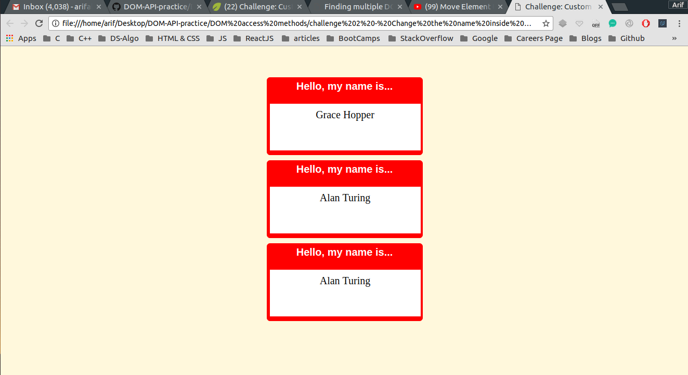
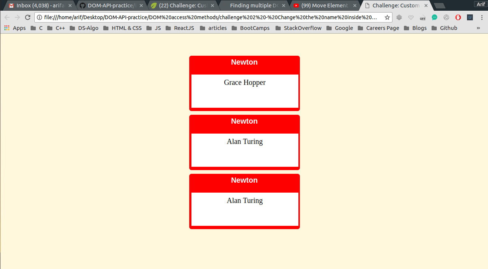

## Challenge 2: Just change the name on the card by manipulating the DOM

I have been trying to manipulate DOM using plane JavaScript through out this project <br />

## Concepts Learnt:

* Store the element to be manipulated in a variable
* You will receive an array which is a HTMLCollection 
* you will need to iterate over every array element and manipulate the DOM accordingly

```js
// h1 element 
// HTML Collection
var h1Els = document.getElementsByTagName("h1");
// Iterating over every array element
for ( var i = 0; i < h1Els.length; ++i) {
    h1Els[i].innerHTML =
        "Newton";
}
```

Below are two pictures showing before and after adding JavaScript to our WebPage


### Before Adding JS

<p align="center">
  
</p>

#### TIP : Here Java Script is manipulating the DOM

### After Adding JS

<p align="center">
  
</p> 


#### In the second image the DOM has been manipulated and the card name has been changed