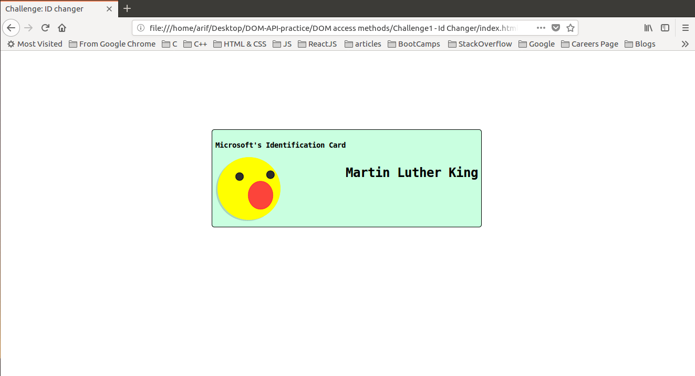

## Adding JavaScript to a Wesbsite 

I have been trying to manipulate DOM using plane JavaScript through out this project <br />

## Concepts Learnt:

* Store the element to be manipulated in a variable
* apply the DOM method on this variable e.g see below

```
// h1 element 
var h1El = document.getElementById("id-name");
// Changing the content of innerHTML
h1El.innerHTML = "Martin Luther King";
```

Below are two pictures showing before and after adding JavaScript to our WebPage


### Before Adding JS

<p align="center">
  
</p>

#### TIP : Here Java Script is manipulating the DOM

### After Adding JS

<p align="center">
  
</p> 


#### In the second image the DOM has been manipulated