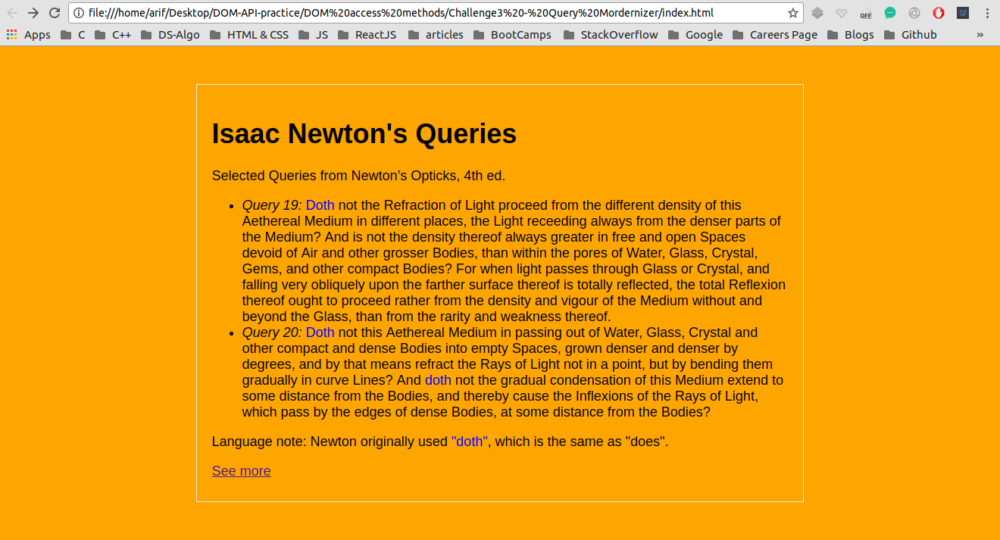
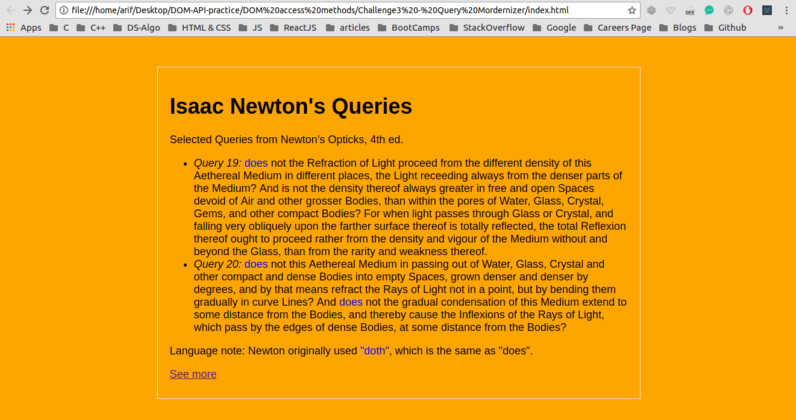

## Finding Elements by ID and manipulating the DOM

I have been trying to manipulate DOM using plane JavaScript through out this project <br />

## Concepts Learnt:

* document.querySelectorAll("CSS Selector");

```js
        // Step 1: Store all doth that are inside lis in dothEls
        var dothEls = document.querySelectorAll("ul .doth");
        // Step 2: Iterate through them and change doth to does
        for ( var i = 0; i < dothEls.length; ++i ) {
            dothEls[i].innerHTML = "does";
        }
```

Below are two pictures before and after adding JavaScript to our WebPage

### Before Adding JS

<p align="center">
  
</p>

#### TIP : Here Java Script is manipulating the DOM

### After Adding JS

<p align="center">
  
</p> 


#### In the second image the DOM has been manipulated