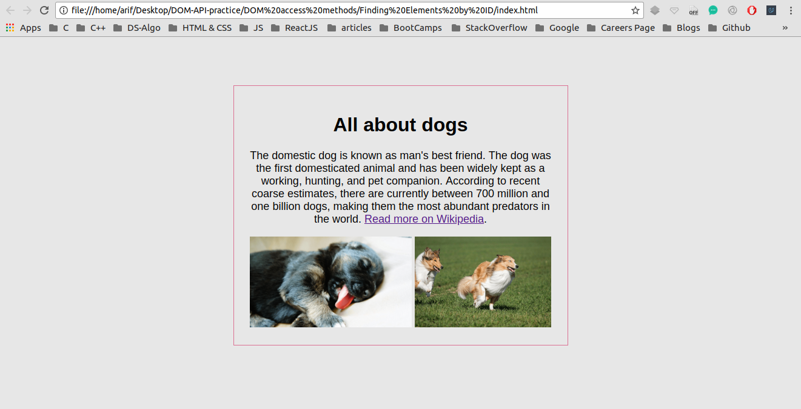

## Finding Elements by ID and manipulating the DOM

I have been trying to manipulate DOM using plane JavaScript through out this project <br />

## Concepts Learnt:

* Learnt that CSS should be placed inside  < head> tag to avoid FOUC - Flash of Unstyled Content
* Learnt that JScript should be placed just above closing  < body> tag 
  * This is to makesure that JS is applied to HTML and CSS after loading the later two 
  * If violated, the JS will not be applied to the targeted tags, ids, or classes
* innerHtml - you'll be able to change your text and HTML as you may like

```
  document.body.innerHTML = "some text";
  // here we are manipulating the innerHTML of body
  // look at second image below
```

* innerHTML is a DOM property to insert content or HTML to a specified id of an element
  * Basically this is DOM manupulation

Below are two pictures before and after adding JavaScript to our WebPage


### Before Adding JS

<p align="center">
  
</p>

#### TIP : Here Java Script is manipulating the DOM


### After Adding JS

<p align="center">
  
</p> 


#### In the second image the DOM has been manipulated