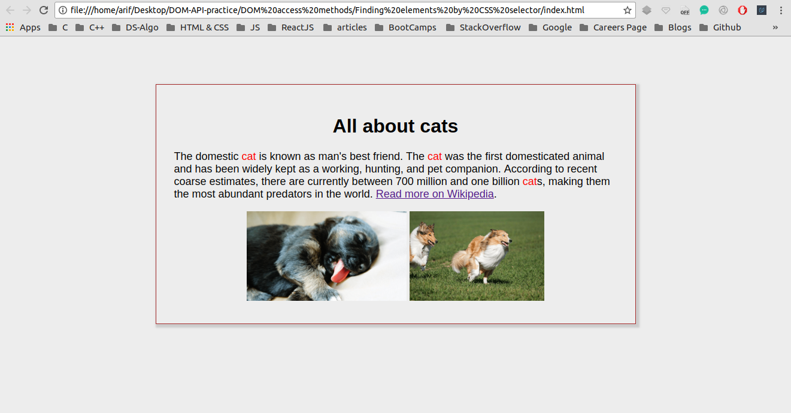
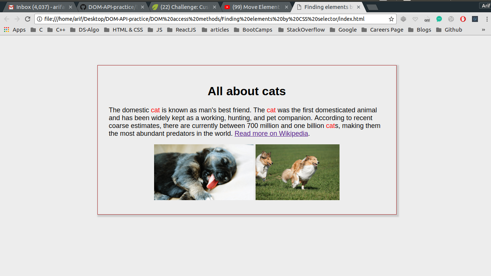

## Finding Elements by ID and manipulating the DOM

I have been trying to manipulate DOM using plane JavaScript through out this project <br />

## Concepts Learnt:

* document.querySelectorAll("CSS Selector");
* querySelectorAll() method returns a NodeList of given CSS Selector

```js
// A NodeList of all p tags with class animal
var nameEls = document.querySelectorAll("p .animal");
// console.log( nameEls );
// NodeList[0]
// console.log( nameEls[0] );

for ( var i = 0; i < nameEls.length; ++i ) {
    nameEls[i].innerHTML = "cat";
}
```

Below are two pictures before and after adding JavaScript to our WebPage

### Before Adding JS

<p align="center">
  
</p>

#### TIP : Here Java Script is manipulating the DOM

### After Adding JS

<p align="center">
  
</p> 


#### In the second image the DOM has been manipulated