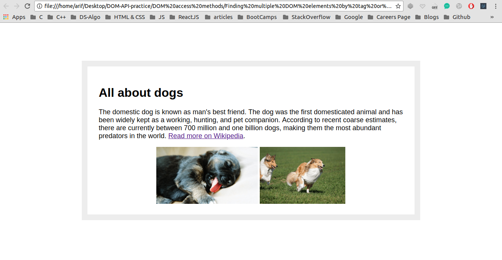
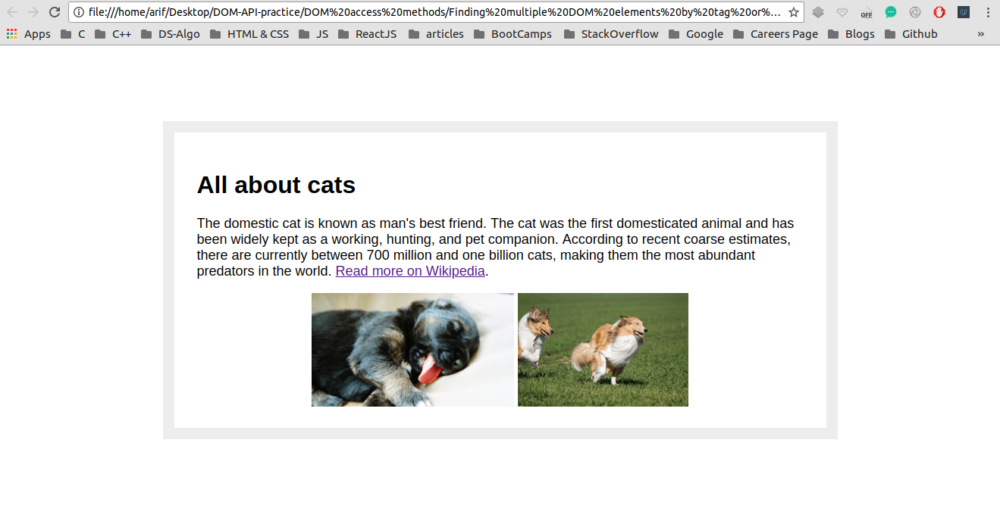

## Finding multiple DOM elements by tag or class name 

I have been trying to manipulate DOM using plane JavaScript through out this project <br />

## Concepts Learnt:

* document.getElementsByTagName("tagname");
* document.getElementsByClassName("className");
* The above two returns an object that itself is a HTMLCollection of objects
* We can iterate over this entire object using a for loop and doing necessary modifications on every ith element

```js
var spanEls = document.getElementsByTagName("span");
// console.log( spanEls ); for Debugging purpose

for( var i = 0; i < spanEls.length; ++i ){
    spanEls[i].innerHTML = "cat";
}
```

```js
var animalEls = document.getElementsByClassName("animal");
// console.log( animalEls );  // for debugging purpose

for ( var i = 0; i < animalEls.length; ++i ){
    animalEls[i].innerHTML = "cat";
}
```

Below are two pictures before and after adding JavaScript to our WebPage


### Before Adding JS

<p align="center">
  
</p>

#### TIP : Here Java Script is manipulating the DOM

### After Adding JS

<p align="center">
  
</p> 


#### In the second image the DOM has been manipulated
#### Observe that, in the second pic all the words "dogs" have been replaced by the word "cat" by manipulating the DOM