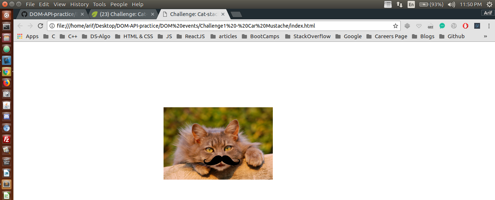

## Finding Elements by ID and manipulating the DOM

I have been trying to manipulate DOM using plane JavaScript through out this project <br />

## Concepts Learnt:

* clientX
* clientY
* EventListeners

```js
var catPic = document.getElementById("cat-pic");
var onCatClick = function (e) {
    console.log(e);

    var stashePic = document.getElementById("mustache-pic");
    var xPosition = e.clientX - (stashePic.offsetWidth / 2);
    var yPosition = e.clientY - (stashePic.offsetHeight / 2);

    stashePic.style.top = yPosition + "px";
    stashePic.style.left = xPosition + "px";
};

catPic.addEventListener("click", onCatClick);
```

Below are two pictures before and after adding JavaScript to our WebPage

### Before Adding JS

<p align="center">
  
</p>

#### TIP : Here Java Script is manipulating the DOM

### After Adding JS

<p align="center">
  
</p> 


#### In the second image the DOM has been manipulated
