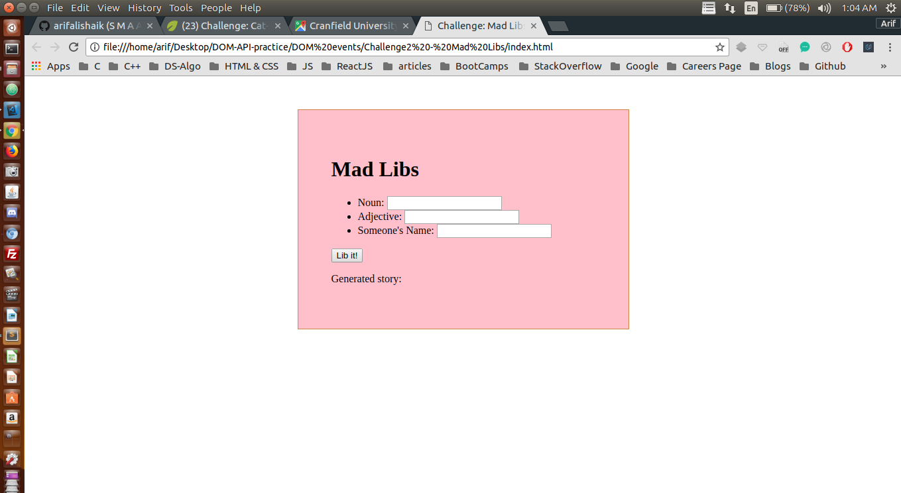
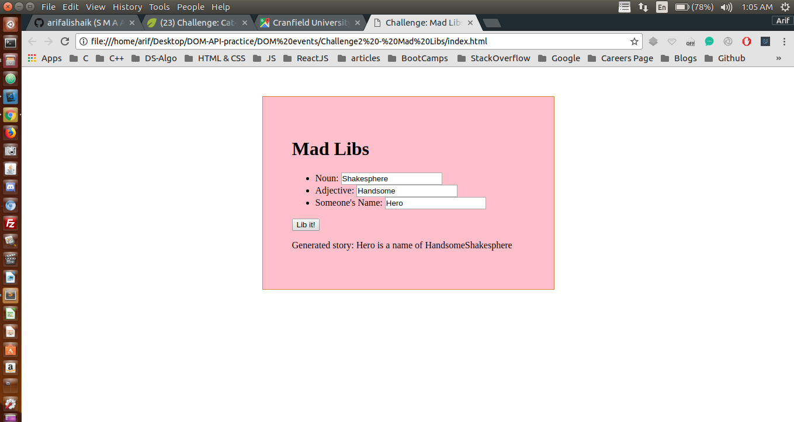

## Finding Elements by ID and manipulating the DOM

I have been trying to manipulate DOM using plane JavaScript through out this project <br />

## Concepts Learnt:

* to be Updated

```js
var libButton = document.getElementById('lib-button');

var libIt = function () {
    var noun = document.getElementById("noun").value;
    var adjective = document.getElementById("adjective").value;
    var person = document.getElementById("person").value;

    var storyDiv = document.getElementById("story");
    storyDiv.innerHTML = person + " is a name of " + adjective + noun;
};

libButton.addEventListener('click', libIt);
```

Below are two pictures before and after adding JavaScript to our WebPage

### Before Adding JS

<p align="center">
  
</p>

#### TIP : Here Java Script is manipulating the DOM

### After Adding JS

<p align="center">
  
</p> 


#### In the second image the DOM has been manipulated