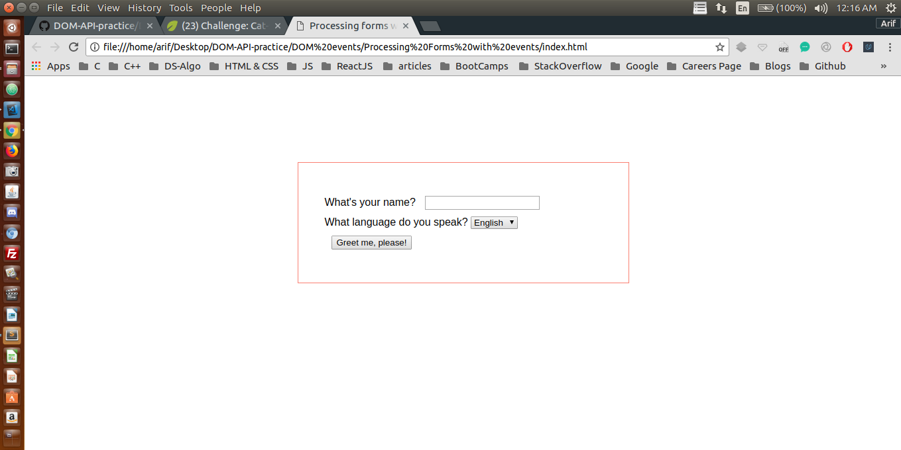
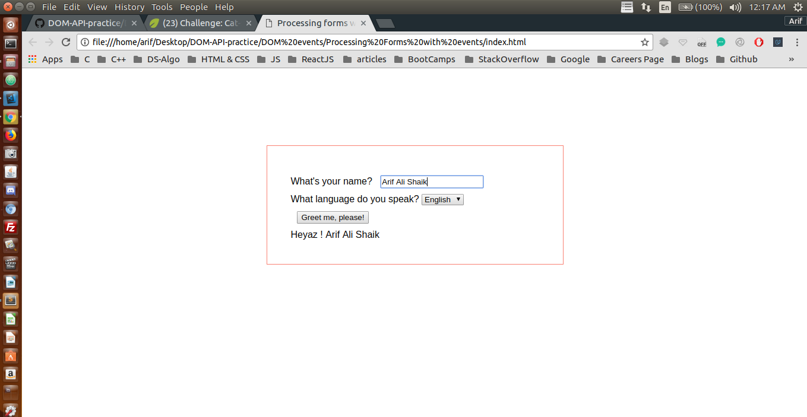

## Finding Elements by ID and manipulating the DOM

I have been trying to manipulate DOM using plane JavaScript through out this project <br />

## Concepts Learnt:

* document.getElementById("Id-name").value;
* appending .value in the end brings all the value of the form element. Please look below code

```js
// Step 1: Find the element we want the event on
var buttonEl = document.getElementById("button");
// Step 2: Define the event listener function
var onButtonClick = function () {
    var nameEl = document.getElementById("name").value;
    // console.log( nameEl ); for debugging
    var greeting = " Heyaz !  " + nameEl;
    document.getElementById("message").textContent += greeting;

}
// Step 3: Attach event listener to element
buttonEl.addEventListener("click", onButtonClick);
```

Below are two pictures before and after adding JavaScript to our WebPage

### Before Adding JS

<p align="center">
  
</p>

#### TIP : Here Java Script is manipulating the DOM

### After Adding JS

<p align="center">
  
</p> 


#### In the second image the DOM has been manipulated
