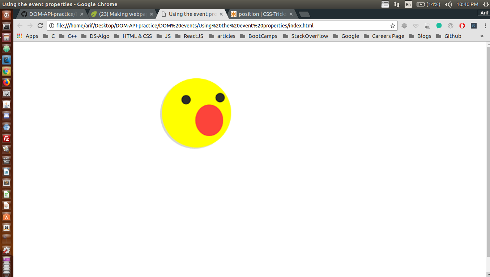
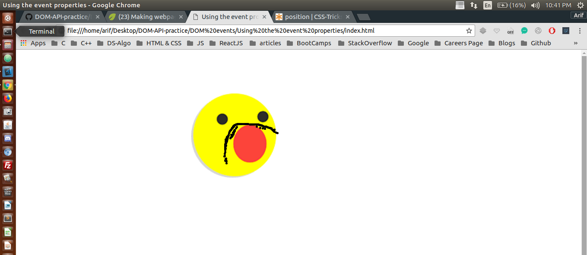

## Finding Elements by ID and manipulating the DOM

I have been trying to manipulate DOM using plane JavaScript through out this project <br />

## Concepts Learnt:

* clientX
* clientY
* EventListeners

```js
    // 1. Find and store the element we want to listen to events on.
    var imgEl = document.getElementById("face");

    // 2. Define the function that will respond to the event.
    var onMouseMove = function(e){
        // console.log(e);
        // <div>
        var divEl = document.createElement("div");
        divEl.className = "beard";
        document.body.appendChild( divEl );
        divEl.style.top = e.clientY + "px";
        divEl.style.left = e.clientX + "px";
    }

    // 3. Add the event listener for the element and function
    imgEl.addEventListener( "mousemove", onMouseMove );
```

Below are two pictures before and after adding JavaScript to our WebPage

### Before Adding JS

<p align="center">
  
</p>

#### TIP : Here Java Script is manipulating the DOM

### After Adding JS

<p align="center">
  
</p> 


#### In the second image the DOM has been manipulated
