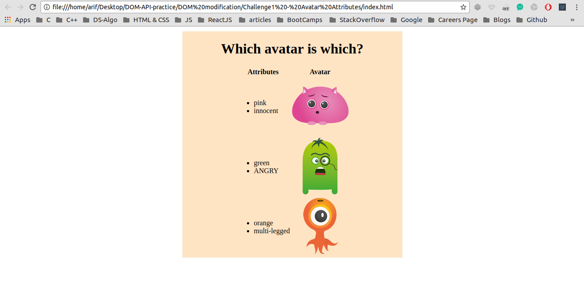
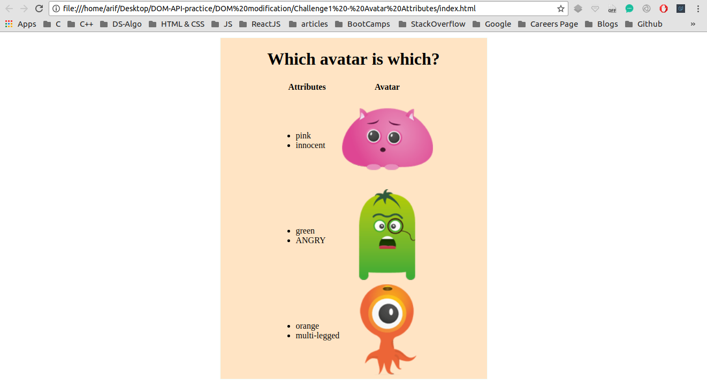

## Finding multiple DOM elements by tag or class name 

I have been trying to manipulate DOM using plane JavaScript through out this project <br />

## Concepts Learnt:

* To be Updated


```js
var avatarEls = document.getElementsByTagName("img");
// console.log( avatarEls ); // for debugging purposes
for (var i = 0; i < avatarEls.length; ++i) {
    avatarEls[i].height = 170;
    avatarEls[i].title = avatarEls[i].alt;
}
```

Below are two pictures before and after adding JavaScript to our WebPage

### Before Adding JS

<p align="center">
  
</p>

#### TIP : Here Java Script is manipulating the DOM

### After Adding JS

<p align="center">
  
</p> 


#### In the second image the DOM has been manipulated 
#### The height of every image has been modified