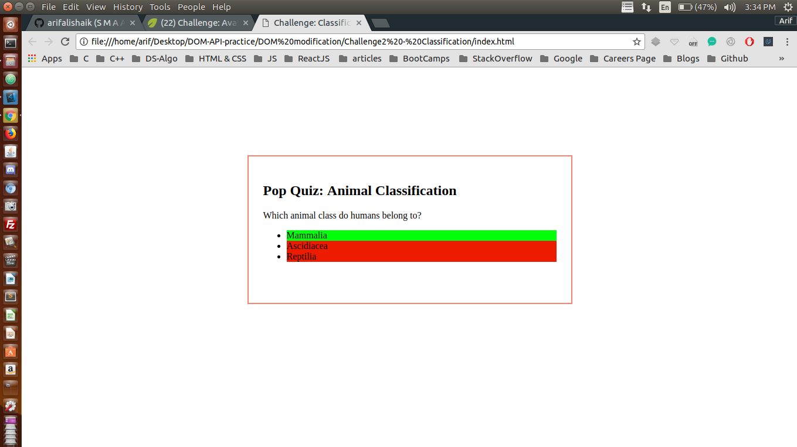

## Finding multiple DOM elements by tag or class name 

I have been trying to manipulate DOM using plane JavaScript through out this project <br />

## Concepts Learnt:

* To be Updated


```js

var answers = document.querySelectorAll('#answers li');
console.log(answers);
answers[0].className = "right-answer";
answers[1].className = "wrong-answer";
answers[2].className = "wrong-answer";
```

Below are two pictures before and after adding JavaScript to our WebPage

### Before Adding JS

<p align="center">
  
</p>

#### TIP : Here Java Script is manipulating the DOM

### After Adding JS

<p align="center">
  
</p> 


#### In the second image the DOM has been manipulated 
