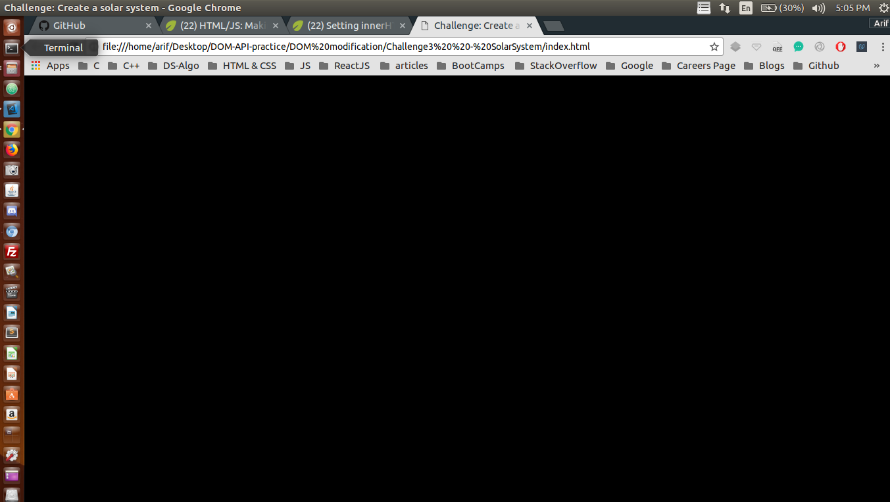
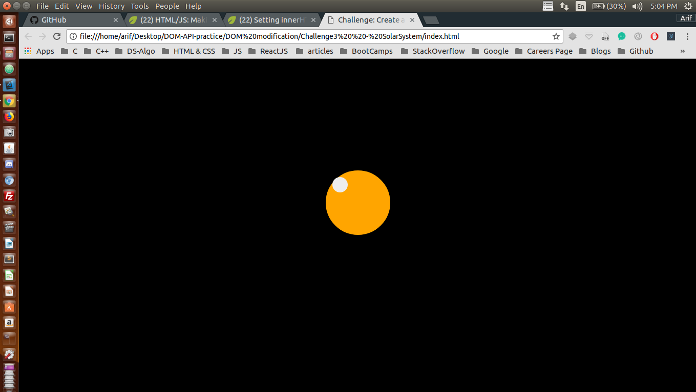

## Changing Styles

I have been trying to manipulate DOM using plane JavaScript through out this project <br />

## Concepts Learnt:

* To be Updated


```js
//  </div> 1
var planetEl = document.createElement('div');
planetEl.style.backgroundColor = "orange";
planetEl.className = "planet";
document.body.appendChild(planetEl);

// <div> 2
var moonEl = document.createElement('div');
moonEl.className = "moon";
planetEl.appendChild(moonEl);
```

Below are two pictures before and after adding JavaScript to our WebPage

### Before Adding JS

<p align="center">
  
</p>

#### TIP : Here Java Script is manipulating the DOM

### After Adding JS

<p align="center">
  
</p> 


#### In the second image the DOM has been manipulated