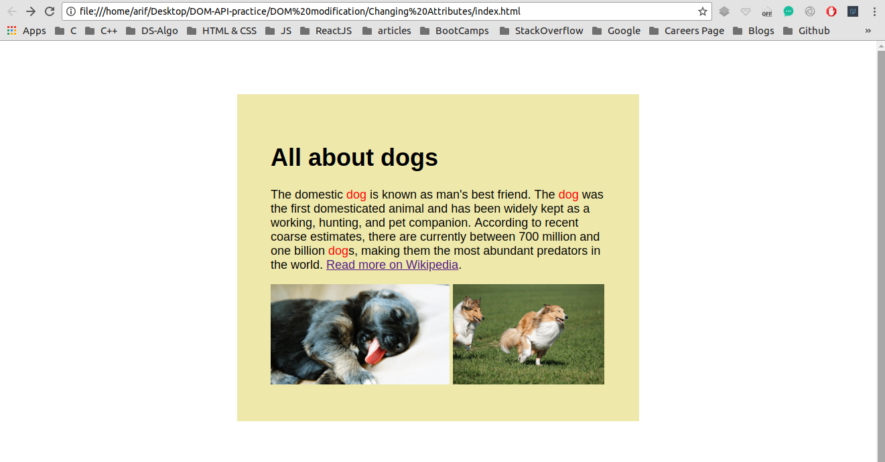
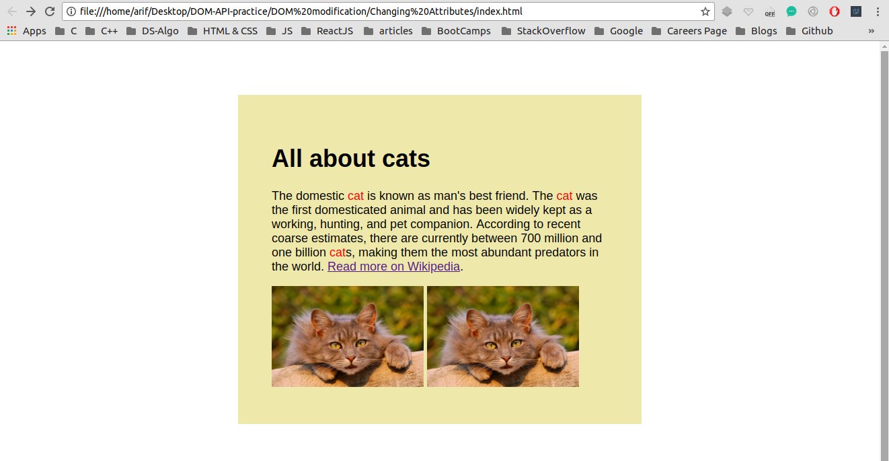

## Finding multiple DOM elements by tag or class name 

I have been trying to manipulate DOM using plane JavaScript through out this project <br />

## Concepts Learnt:

* Learnt about how we can also target an attribute of a HTML element and manipulate it from the DOM


```js
var imageEls = document.getElementsByTagName("img");
for (var i = 0; i < imageEls.length; i++) {
    imageEls[i].src = "https://www.kasandbox.org/programming-images/animals/cat.png";
}

var linkEls = document.querySelectorAll("a[href*=\"Dog\"]");
for (var i = 0; i < linkEls.length; i++) {
    linkEls[i].href = "http://en.wikipedia.org/wiki/Cat";
}

var headingEl = document.querySelector("#heading");
headingEl.innerHTML = "All about cats";

var nameEls = document.querySelectorAll("p .animal");
for (var i = 0; i < nameEls.length; i++) {
    nameEls[i].innerHTML = "cat";
}

var headingEl = document.getElementById("heading");
headingEl.style.color = "Orange";
headingEl.style.backgroundColor = "Black";
headingEl.style.textAlign = "center"
```

Below are two pictures before and after adding JavaScript to our WebPage

### Before Adding JS

<p align="center">
  
</p>

#### TIP : Here Java Script is manipulating the DOM

### After Adding JS

<p align="center">
  
</p> 


#### In the second image the DOM has been manipulated