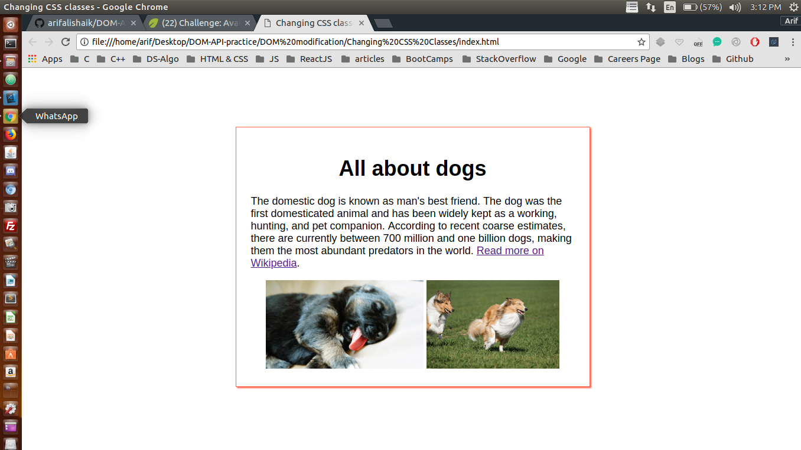
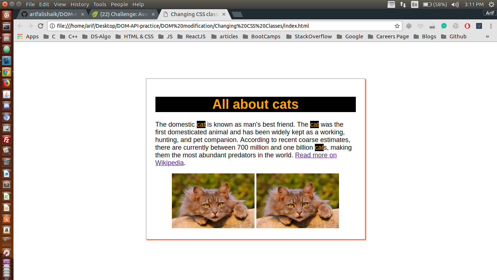

## Finding multiple DOM elements by tag or class name 

I have been trying to manipulate DOM using plane JavaScript through out this project <br />

## Concepts Learnt:

* Changing CSS styles from JS can make you code very messy, instead add CSS classes and append this class to the target HTML element or node dynamically
* HTML attribute for class name is jusr class. but
* Class is actually a keyword in JS and it has a special meaning for that. so browsers decided to use ClassName to refer to the HTML class attribute, just to make sure they wouldn't get confused
* So, this method esentially replaces the use of document.style.property = ""; method


```js
var imageEls = document.getElementsByTagName("img");
for (var i = 0; i < imageEls.length; i++) {
    imageEls[i].src = "https://www.kasandbox.org/programming-images/animals/cat.png";
}

var linkEls = document.querySelectorAll("a[href*=\"Dog\"]");
for (var i = 0; i < linkEls.length; i++) {
    linkEls[i].href = "http://en.wikipedia.org/wiki/Cat";
}

var headingEl = document.querySelector("#heading");
headingEl.className = "catcolors";
headingEl.innerHTML = "All about cats";
// console.log(headingEl); // for debugging

var nameEls = document.querySelectorAll("p .animal");
for (var i = 0; i < nameEls.length; i++) {
    nameEls[i].className += " catcolors";
    nameEls[i].classList.add("catcolors")
    nameEls[i].innerHTML = "cat";
}
```

Below are two pictures before and after adding JavaScript to our WebPage

### Before Adding JS

<p align="center">
  
</p>

#### TIP : Here Java Script is manipulating the DOM

### After Adding JS

<p align="center">
  
</p> 


#### In the second image the DOM has been manipulated