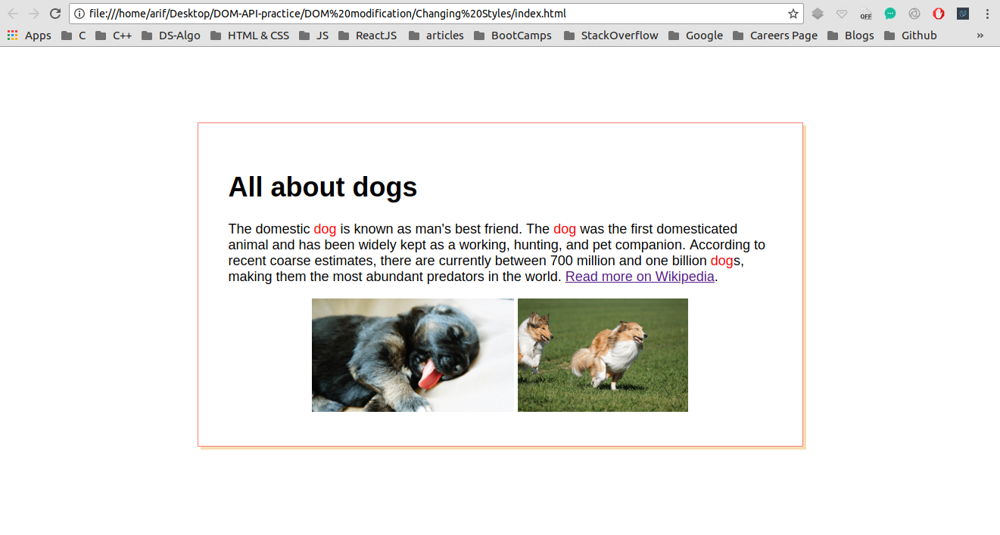
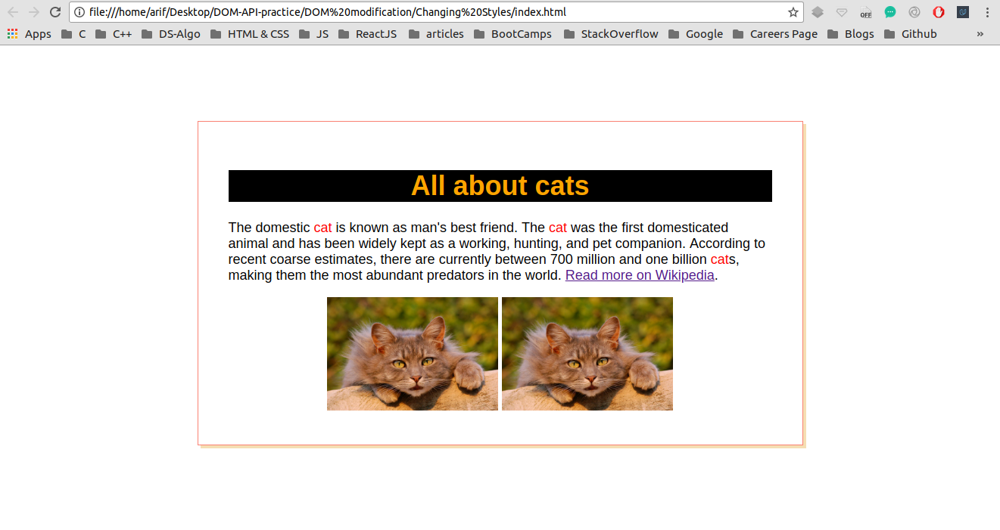

## Changing Styles

I have been trying to manipulate DOM using plane JavaScript through out this project <br />

## Concepts Learnt:

* To be updated


```js
var imgTags = document.getElementsByTagName("img");
// console.log(imgTags); for debugging purposes
for (var i = 0; i < imgTags.length; ++i) {
    imgTags[i].src = "https://www.kasandbox.org/programming-images/animals/cat.png";
}

var linkEls = document.querySelectorAll('a[href*="Dog"]');
for (var i = 0; i < linkEls.length; ++i) {
    linkEls[i].href = "http://en.wikipedia.org/wiki/Cat";
}
```

Below are two pictures before and after adding JavaScript to our WebPage

### Before Adding JS

<p align="center">
  
</p>

#### TIP : Here Java Script is manipulating the DOM

### After Adding JS

<p align="center">
  
</p> 


#### In the second image the DOM has been manipulated