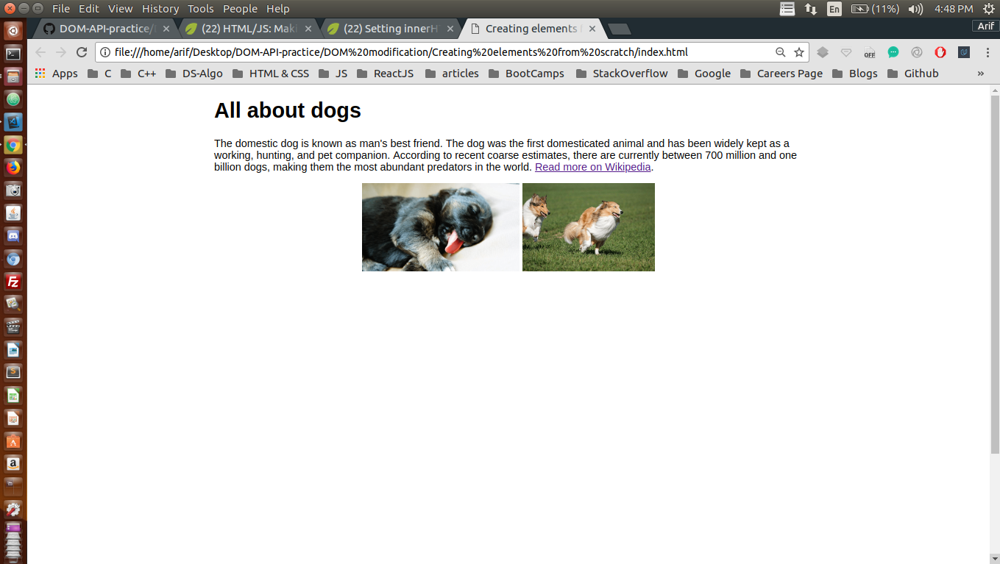
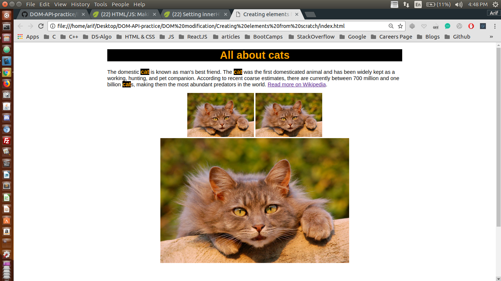

## Changing Styles

I have been trying to manipulate DOM using plane JavaScript through out this project <br />

## Concepts Learnt:

* A new HTML element created from JS by var imageEl = document.createElement("img"); 
* The above command creates an HTML image element 
* imageEl.src = "url";  setting the source attribute
* imageEl.alt = "Photo of Cat";  Setting the alt of image element create

* Now, once you have created the image element, you can append it to any Node in the DOM
* Now, this is the place where I have felt that DOM is truly a tree in structure
* If I want to append it as the leaf node at the bottom of the body
  * body.appendChild( imageEl );
  * Likewise, you can append this to any HTML element in the DOM as its child
* Please look below for the simple code


```js
var nameEls = document.querySelectorAll("p .animal");
for ( var i = 0; i < nameEls.length; i++ ) {
    // <strong>
    var strongEl = document.createElement("strong");
    // "cat"
    var strongText = document.createTextNode("cat");
    // <strong> cat <strong>
    strongEl.appendChild( strongText );
    nameEls[i].innerHTML = "";
    nameEls[i].appendChild( strongEl );

    nameEls[i].className += " catcolors";
    nameEls[i].style.fontSize = 20+"px";
}

// 
var catEl = document.createElement("img");
catEl.src = "https://www.kasandbox.org/programming-images/animals/cat.png";
catEl.alt = "Photo of Cute Cat";

var imagesEl = document.getElementsByClassName("images");
// console.log( imagesEl );
for ( var i = 0; i < imagesEl.length; ++i ){
    imagesEl[i].appendChild( catEl );
}
```

Below are two pictures before and after adding JavaScript to our WebPage

### Before Adding JS

<p align="center">
  
</p>

#### TIP : Here Java Script is manipulating the DOM

### After Adding JS

<p align="center">
  
</p> 


#### In the second image the DOM has been manipulated