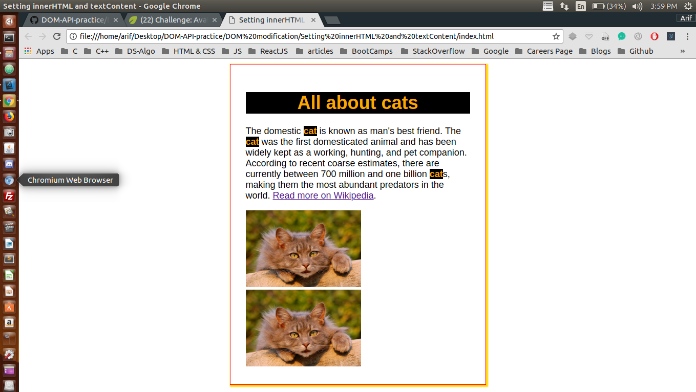

## Changing Styles

I have been trying to manipulate DOM using plane JavaScript through out this project <br />

## Concepts Learnt:

* innerHTML is a DOM property that can be used to pass text or HTML to change the contents of the targeted node or element
* textContent is similar to innerHTML except that you cannot pass HTML through it
* When you try to do complex DOM manipulations both innerHTML and textContent may turnoff the eventListeners, so we need to be very careful while using them
* You can use innerHTML DOM property to pass entire webpages 
* But, doing that may quickly make your code very messy and hard to debug


```js
var imageEls = document.getElementsByTagName("img");
for (var i = 0; i < imageEls.length; i++) {
    imageEls[i].src = "https://www.kasandbox.org/programming-images/animals/cat.png";
}

var linkEls = document.querySelectorAll("a[href*=\"Dog\"]");
for (var i = 0; i < linkEls.length; i++) {
    linkEls[i].href = "http://en.wikipedia.org/wiki/Cat";
}

var headingEl = document.querySelector("#heading");
headingEl.className = "catcolors";
headingEl.style.textAlign = "center";
headingEl.textContent = "All about cats";

var nameEls = document.querySelectorAll("p .animal");
for (var i = 0; i < nameEls.length; i++) {
    nameEls[i].innerHTML = "<strong>cat</strong>";
    nameEls[i].className += " catcolors";
}
```

Below are two pictures before and after adding JavaScript to our WebPage

### Before Adding JS

<p align="center">
  
</p>

#### TIP : Here Java Script is manipulating the DOM

### After Adding JS

<p align="center">
  
</p> 


#### In the second image the DOM has been manipulated